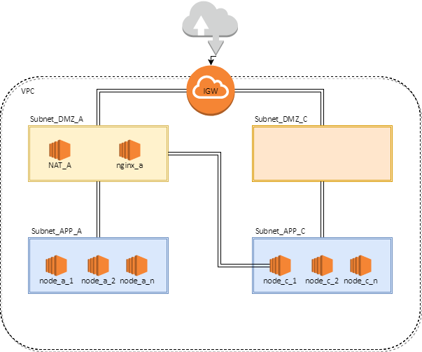

### Ferramentas utilizadas para criar a arquitetura ###

* [Nodejs](https://nodejs.org/)
* [express lib for Nodejs](http://expressjs.com/)
* [Docker](https://www.docker.com/)
* [Terraform](https://www.terraform.io)
* [Ubuntu Server](https://www.ubuntu.com/download/server)
* [aws cli](http://docs.aws.amazon.com/pt_br/cli/latest/userguide/installing.html)

### Estrutura do repositório ###
```
├── docker
│   ├── docker-nginx-consul
│   └── nodejs
├── scripts
│   └── stress_test.sh
├── terraform
│   ├── arch-main-state.tf
│   ├── gera-chave-ssh.sh
│   ├── makeconfig.sh
│   ├── modules
│   │   ├── eip
│   │   ├── env
│   │   ├── instances
│   │   │   ├── app-instances
│   │   │   └── arch-instances
│   │   ├── routes
│   │   ├── security-group
│   │   ├── subnets
│   │   └── vpc
│   ├── README.md
│   ├── ssh_keys
│   │   ├── debug-key
│   │   └── debug-key.pub
│   ├── ssh-key.tf
└── vagrant
```
```
> Docker - Cria as imagens aqui utilizadas

> Scripts - Contém scripts de stress web e scripts em geral

> Terraform - Utilizado para deployar a arquitetura exibida abaixo de forma automática

> Vagrant - Utilizado para levantar uma maquina Ubuntu de testes, semelhante as utilizadas em produção.

```
### Pré Requisitos ###

1 - Crie sua conta na AWS.

1.1 - Todo o deploy exibido aqui, utiliza a região de N.Virginia que é a que hoje possui o menor custo na AWS.

2 - Crie um bucket no S3 - (a região utilizada neste exemplo é a Norte Virginia - us-east-1)

2.1 - Crie uma chave para utilização de API nas configurações de IAM

2.2 - Configure seu sistema utilizando a aws_cli, com a chave obtida no passo anterior

```
aws config
```

3 - Atualize os seguintes arquivos com o nome do bucket criado

>chaordic/terraform
    bucket = "_NOME_DO_BUCKET_CRIADO_"
    region = "us-east-1"  <- Caso queira utilizar outra região
	
4 - Execute o arquivo que gera a chave ssh que será utilizada para acesso aos servidores caso necessário:

```
terraform/gera-chave-ssh.sh
```


5 - Baixe a versão mais recente do terraform e a inclua no seu PATH de arquivos executáveis, maiores informações em: 
* [Terraform](https://www.terraform.io)

6 - Execute o seguinte script para exibir o plano de deploy em sua conta:

```
terraform/makeconfig.sh
```

### Aplicação da arquitetura ###

Caso esteja de acordo:

7 - Faz o deploy da arquitetura proposta na sua conta:

```
terraform apply

```

### Estrutura  ###

A utilização deste repositório ira disponibilizar uma arquitetura que contém:

1 - Instancia com um balanceador de carga (nginx + consul + consul-template + register)

2 - Instancias de aplicação (nodejs + register)

3 - Criação de uma zona DNS interna para comunicação entre os servidores


> Toda a arquitetura de rede, regras de FW, Zonas DNS, etc serão automaticamente criadas, ela será parecida com a proposta abaixo:


### Arquitetura proposta ###



### Observações importantes ###

Como este repositório se propõem apenas a exibição, não foram implementados os seguintes aspectos:

- ELB para distribuir a carga entre os servidores Frontend
- Instancia de Nat na Zona C
- Auto Scaling group para levantar mais instancias de FrontEnd e Backend
-- O ASG também é responsável por subir novas instancias em caso de erro e substituir as instancias com problema, tornando elas efêmeras.
- Bastion Host (que nesta arquitetura é a instancia de Nginx)
- ELK, graylog, etc para tratamento dos logs de forma centralizada;
- Goaccess para visualização de logs em tempo real


Utilizados as informações contidas aqui, é fácil e rápida a implementação de tais funcionalidades.

### Como funciona? ###

Para testar a arquitetura:

No primeiro deploy, é possível que todas as configurações demorem cerca de 10min até estarem disponíveis, isso acontece devido ao servidor de aplicações ficar disponível antes do servidor consul e não conseguir se registrar, tendo que aguardar assim 5 min até que possa tentar novamente a conexão. Não é recomendável diminuir este tempo, pois isso pode causar fload na rede desnecessário.


Após a aplicação de todos os passos descritos acima:

1) Logue na sua conta AWS, va em ec2>>instances
- Procure pela instancia "nginx-web-proxy", e pegue o endereço contido em:
Public DNS (IPv4)

2) Cole o endereço em seu navegador

3) Aperte F5 para verificar o load-balance funcionando

4) Para verificar os serviços no Consul-Server, habilite o seguinte Security-Group na instancia nginx-web-proxy

- tf_df_all_only_for_test

Com ele será liberada a porta 8500 no servidor consul, sendo o acesso feito da seguinte forma:

http://IP_NGINX:8500

### Deploy de nova aplicação ###

1) Vá ao diretório docker

2) Atualize a aplicação "mynode.js"

3) Docker build -t novapp .

4) Suba uma nova instancia node com o no container

4.1) Para rollback, basta voltar a versão do container anterior. O balancer sempre vai se configurar sozinho.